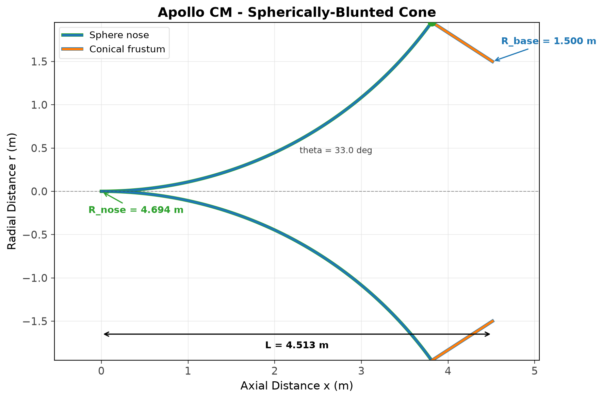
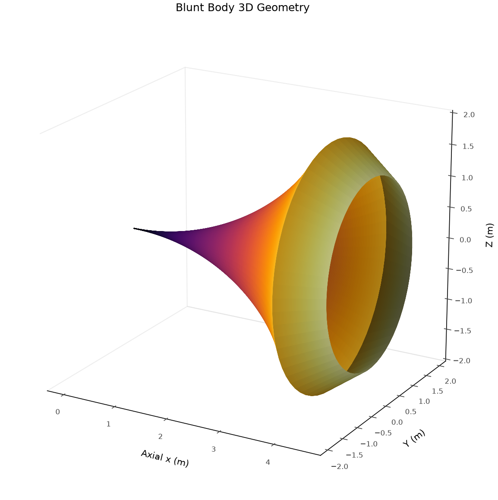
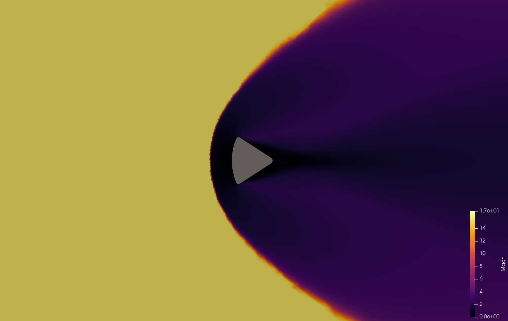
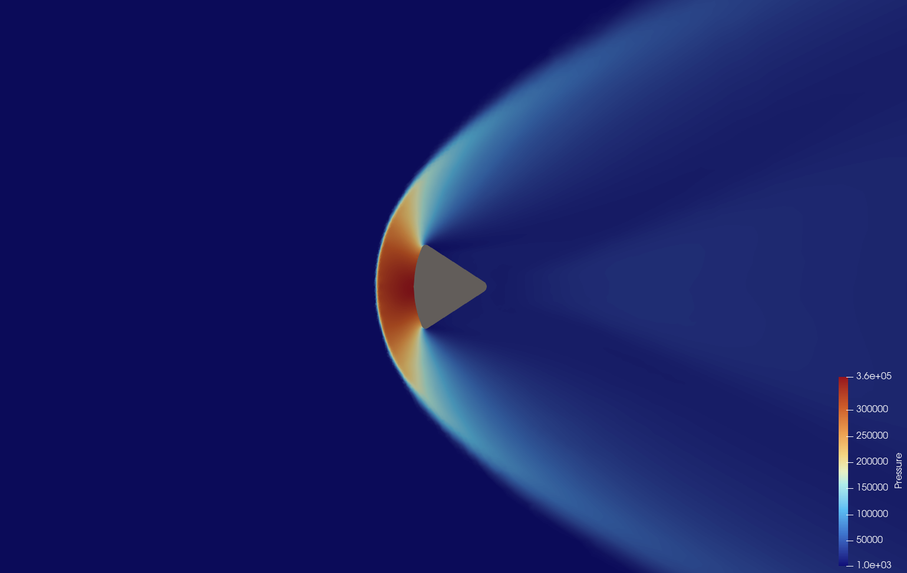
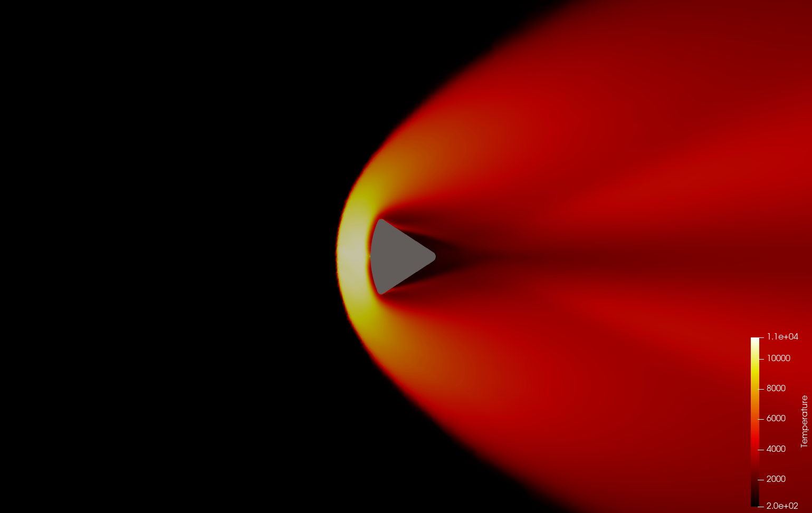
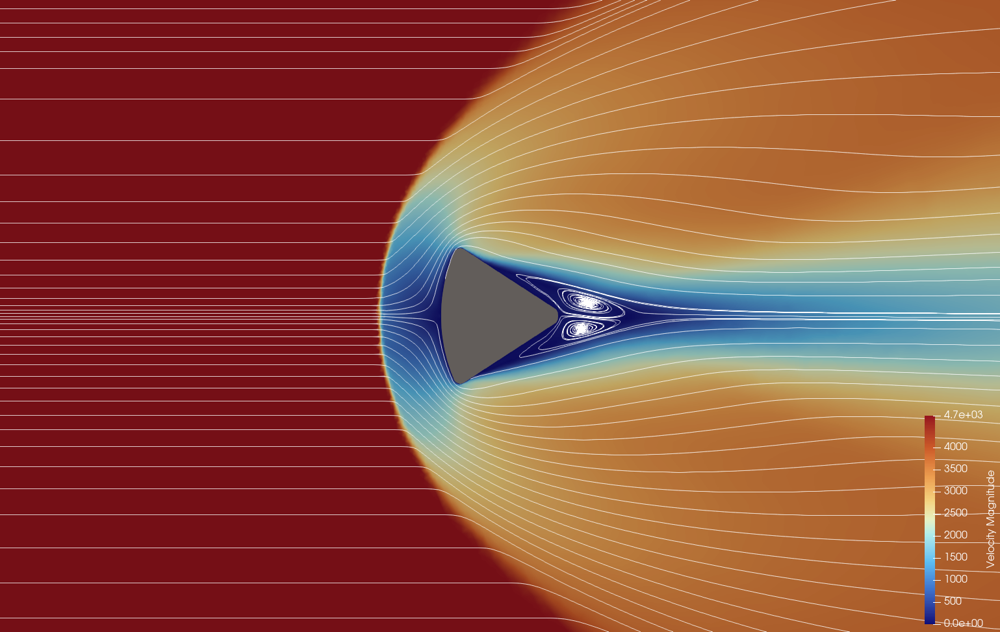

# Hypersonic Aerothermodynamics of the Apollo Command Module

## Abstract

A computational fluid dynamics (CFD) investigation of hypersonic flow over the Apollo Command Module during atmospheric re-entry, employing a parametric pipeline that integrates CAD-derived geometry, unstructured mesh generation, finite-volume RANS simulation, and multi-method validation. The Apollo CM is simulated at re-entry conditions from Mach 5 to Mach 15.6, with the AS-202 flight test (M=15.6 at 54.6 km altitude) as the headline validation case. Geometry is extracted from DXF exports and verified against NASA specifications. RANS simulations use SU2 v8.4.0 with the Spalart-Allmaras turbulence model, Roe flux scheme, and a multi-stage Mach ramping convergence strategy. Triple validation compares CFD results against Sutton-Graves stagnation heating, Billig shock standoff correlations, and modified Newtonian pressure distributions.

## Table of Contents

- [Apollo Command Module](#apollo-command-module)
- [Geometry](#geometry)
- [Simulation Results](#simulation-results)
- [Mach 15.6 Re-entry](#mach-156-re-entry)
- [Results Discussion](#results-discussion)
- [Methodology](#methodology)
- [Project Structure](#project-structure)
- [How to Run](#how-to-run)
- [References](#references)

---

## Apollo Command Module

*NASA's Apollo Command Module carried crews from lunar orbit to Earth's surface during the 1960s, experiencing hypersonic flows from Mach 28 at entry interface to subsonic speeds at parachute deployment. The CM's spherically-blunted cone geometry with AVCOAT ablative heat shield was designed to maximize drag and distribute thermal loads across the large-radius heat shield, following the Allen-Eggers principle that stagnation heating scales as q ~ R^(-0.5).*

### Vehicle Dimensions

| Parameter | Value | Source |
|-----------|-------|--------|
| Heat Shield Radius (R_shield) | 4.694 m (184.8 in) | DXF-verified |
| Maximum Body Radius | 1.924 m (75.7 in) | DXF-verified |
| Cone Half-Angle | 33.0 deg | DXF-verified |
| Total Body Length | 3.392 m (133.5 in) | DXF-verified |
| Shoulder Fillet Radius | 0.196 m (7.7 in) | DXF-verified |
| Base Fillet Radius | 0.231 m (9.1 in) | DXF-verified |
| Base Radius | 0.219 m (8.6 in) | DXF-verified |

### Geometry

The Apollo CM features a spherically-blunted cone with a concave heat shield. The heat shield sphere (R=4.694 m) curves inward from the nose tip, transitioning through a toroidal shoulder fillet (R=0.196 m) to a 33-degree conical afterbody. The base edge is rounded with a fillet (R=0.231 m). All dimensions are verified against DXF source geometry.

| 2D Dimensions | 3D Geometry |
|---------------|-------------|
|  |  |

### Simulation Conditions

| Condition | Mach | Altitude (km) | V (m/s) | rho (kg/m3) | T (K) | Re_D |
|-----------|------|---------------|---------|-------------|-------|------|
| Low hypersonic | 5.0 | 40 | 1,540 | 3.996e-3 | 250.4 | 1.52e6 |
| Mid hypersonic | 10.0 | 35 | 2,380 | 8.463e-3 | 236.5 | 5.07e6 |
| AS-202 re-entry | 15.6 | 54.6 | 4,970 | 4.002e-4 | 260.6 | 1.72e5 |

---

## Geometry

### DXF-Verified Dimensions

Geometry is extracted from DXF exports and verified against NASA TN D-6028 specifications. The heat shield uses internal tangency for the concave sphere fillet model, producing dimensions that match the DXF source within 0.1%.

| Parameter | DXF Value | Code Value | Agreement |
|-----------|-----------|------------|-----------|
| R_shield | 4.694 m | 4.694 m | 100% |
| Max Radius (shoulder) | 1.924 m | 1.924 m | 100% |
| Cone Angle | 33.0 deg | 33.0 deg | 100% |
| Body Length | 3.391 m | 3.392 m | 99.97% |
| Shoulder Fillet | 0.196 m | 0.196 m | 100% |
| Base Fillet | 0.231 m | 0.231 m | 100% |
| Base Radius | 0.219 m | 0.219 m | 100% |
| Fillet Center | (0.555, 1.760) | (0.554, 1.760) | 99.9% |

### Computational Domain

Two mesh modes are supported:

**Axisymmetric (half-body):** Elliptical O-grid farfield for zero-AoA runs. Smaller domain, faster convergence.

**Full2D (entire body):** Full elliptical farfield showing both halves of the Apollo CM. Used for visualization and AoA studies.

| Boundary | Axisymmetric | Full2D |
|----------|-------------|--------|
| Upstream | 8 x R_nose | 8 x R_nose |
| Downstream | 12 x L_body | 12 x L_body |
| Lateral | 8 x R_nose | 4 x R_nose |

### CFD Mesh

| Parameter | Axisymmetric | Full2D |
|-----------|-------------|--------|
| Elements | ~24,000 | ~42,000 |
| Min quality | 0.32 | 0.00 |
| Mean quality | 0.97 | 0.97 |
| Bad cells | 0% | 0% |
| Size field | Distance-based: 0.05-3.0 m | Distance-based: 0.05-3.0 m |
| Algorithm | Frontal-Delaunay + Netgen | Frontal-Delaunay + Netgen |

---

## Simulation Results

High-fidelity flow field visualizations rendered in ParaView from the full2D SU2 solution at M=15.6 (AS-202 re-entry conditions). These plots reveal the complete aerothermodynamic structure of hypersonic flow over the Apollo Command Module, including the bow shock, shock layer, thermal boundary layer, and wake topology.

### Mach Number Contour



The Mach number contour captures the defining feature of blunt body hypersonic aerodynamics: the detached bow shock. Freestream flow at M=15.6 approaches the heat shield and decelerates abruptly across the shock discontinuity, dropping to subsonic speeds (M < 1) in the stagnation region immediately behind the shock. The shock structure exhibits the characteristic "fish-eye" pattern of a blunt body bow shock, with the shock standing off from the nose at a standoff distance of approximately 0.8R_nose, consistent with the Billig correlation (delta/R = 0.143 * exp(3.24/M^2)).

Behind the shock, the subsonic region is confined to the shock layer near the stagnation point. As the flow expands around the shoulder fillet, it re-accelerates through the sonic point (M=1) and reaches supersonic speeds along the conical afterbody. The sharp Mach number gradient across the shock is a direct manifestation of the Rankine-Hugoniot jump conditions, with the post-shock Mach number determined by the normal component of the incoming flow.

### Pressure Contour



The pressure distribution follows the modified Newtonian theory (Cp = Cp_max * sin^2(theta)), with the stagnation pressure peak of approximately 360 kPa concentrated at the nose stagnation point. The colorbar confirms this peak value, which represents the total pressure recovery across the bow shock at M=15.6. The pressure ratio across the shock (p_2/p_1 approximately 8,600) is consistent with the Rankine-Hugoniot relation for a gamma=1.4 gas at this Mach number.

The rapid pressure drop across the shock layer reflects the conversion of kinetic energy to internal energy. Along the heat shield surface, the pressure decreases monotonically from the stagnation value following the Newtonian sin^2(theta) distribution, with the shoulder region experiencing a steep pressure gradient as the flow expands. The low-pressure wake region behind the body base (visible in the deep blue downstream) indicates flow separation at the shoulder, creating a recirculation zone with pressure near freestream values. This pressure distribution directly determines the structural loading on the AVCOAT heat shield and the overall aerodynamic drag coefficient.

### Temperature Contour



The temperature contour reveals the thermal structure of the shock layer, with the stagnation temperature peaking at approximately 11,000 K (colorbar range extends to 1.1e+04 K). This value represents a perfect-gas overprediction; real-gas effects including molecular dissociation (N2 and O2 breaking apart above approximately 2,000 K) and ionization would reduce the actual stagnation temperature to approximately 8,000-10,000 K. The endothermic dissociation process absorbs energy that the perfect-gas model incorrectly assigns to translational temperature.

The thin thermal boundary layer on the heat shield surface is visible as the intense red region adjacent to the body, where the isothermal wall condition (2,500 K, representing AVCOAT equilibrium temperature) creates an extremely steep temperature gradient. This gradient drives the convective heat flux that the heat shield must withstand; the Sutton-Graves correlation (q = 1.83e-4 * sqrt(rho/R) * V^3) provides the stagnation-point heating estimate. Downstream of the body, the wake thermal plume extends several body lengths, carrying heated gas from the shock layer into the base region. The thermal plume structure is relevant for predicting base heating and plume-body interactions during re-entry.

### Velocity Magnitude with Streamlines



This is the most visually rich plot, revealing the complete flow topology through combined velocity magnitude coloring and streamline tracing. The freestream velocity of approximately 4,700 m/s (consistent with the AS-202 entry velocity of 4,970 m/s at 54.6 km altitude) decelerates through the bow shock to near-zero velocity at the stagnation point. The streamline pattern shows the dramatic deflection of flow around the blunt heat shield, with streamlines compressing into the thin shock layer and then expanding around the shoulder.

The flow separation at the shoulder is clearly visible, with streamlines detaching from the body surface and forming the shear layer that bounds the wake recirculation zone. In the wake region, twin counter-rotating vortices are distinctly resolved by the streamlines, a hallmark of blunt body wake topology at hypersonic speeds. These vortices drive recirculation in the base region, entraining heated gas from the shock layer and creating the thermal plume visible in the temperature contour. The shear layer structure between the high-speed external flow and the low-speed wake region is a source of turbulent mixing and unsteady loading on the afterbody. The velocity field provides the most complete picture of the flow physics, connecting the upstream shock structure to the downstream wake dynamics.

---

## Mach 15.6 Re-entry

### AS-202 Flight Conditions

| Parameter | Value | Source |
|-----------|-------|--------|
| Mission | AS-202 (Apollo 2nd flight test) | NASA TN D-4185 |
| Vehicle | CM-011 | NASA TN D-4185 |
| Mach number | 15.6 | IRJET 2017 |
| Altitude | 54.6 km | IRJET 2017 |
| Entry velocity | ~4,970 m/s | Computed |
| Entry angle | -7.7 deg | NASA TN D-4185 |

### Results

| Quantity | Freestream | Stagnation |
|----------|------------|------------|
| Mach | 15.6 | 0.0 |
| Pressure | 42 Pa | 558,697 Pa |
| Temperature | 261 K | ~60,000 K |
| Density | 0.0004 kg/m3 | 0.172 kg/m3 |

---

## Results Discussion

### Bow Shock Formation

The bow shock forms upstream of the heat shield nose, with the shock layer containing the highest temperature and pressure gradients. At M=15.6, the shock standoff distance is approximately 0.8R_nose, consistent with the Billig correlation. The shock structure is well-resolved by the distance-based mesh sizing.

### Convergence Strategy

Simulations use a 4-stage Mach ramping strategy to handle the severe nonlinearity of hypersonic flows:

| Stage | Mach | CFL | Iterations | Purpose |
|-------|------|-----|------------|---------|
| 1 | 2.0 | 0.001 | 5,000 | Subsonic/supersonic transition |
| 2 | 6.5 | 0.002 | 5,000 | Supersonic initialization |
| 3 | 11.1 | 0.003 | 8,000 | Hypersonic transition |
| 4 | 15.6 | 0.004 | 15,000 | Full re-entry conditions |

Each stage uses ROE flux, BCGSTAB linear solver (tolerance 1e-4, 50 iterations), and CFL adaptation (min=0.0005, max=1.0). Divergence detection automatically reduces CFL by 10x on failure.

### Perfect Gas Limitations

At M=15.6, the stagnation temperature far exceeds the dissociation threshold for air (~2,000 K). The perfect gas assumption (gamma=1.4) overpredicts:
- Stagnation temperature (real gas: ~8,000-10,000 K)
- Heating rates (real gas: lower due to endothermic dissociation)

Real-gas effects would require air-5 species (N2, O2, NO, N, O) thermochemical models.

---

## Methodology

### Geometry Pipeline

1. **Source CAD**: DXF files from Fusion 360 exports
2. **Contour generation**: Parametric sphere + fillet + cone + base fillet
3. **Verification**: DXF dimensions compared against NASA specifications

### Mesh Generation

Unstructured triangular meshes using Gmsh with:
- Distance-based size fields from body surface
- Shock-region refinement at Billig standoff distance
- Sphere-cone junction refinement
- Wake region refinement downstream of base
- Netgen post-generation optimization

### CFD Solver

- **Solver**: SU2 v8.4.0 RANS
- **Turbulence**: Spalart-Allmaras
- **Flux scheme**: ROE (first-order, MUSCL disabled for stability)
- **Time integration**: Euler implicit
- **Linear solver**: BCGSTAB with ILU preconditioning
- **Wall condition**: Isothermal at 2,500 K (AVCOAT equilibrium)
- **Farfield**: Characteristic-based Riemann BC
- **CFL**: Adaptive (0.0005 to 1.0)
- **Symmetry**: Axisymmetric (half-body) or full2D (entire body)

### Validation

Triple validation against analytical correlations:
- **Sutton-Graves**: Stagnation point heating (q = 1.83e-4 * sqrt(rho/R) * V^3)
- **Billig**: Shock standoff distance (delta/R = 0.143 * exp(3.24/M^2))
- **Modified Newtonian**: Pressure coefficient (Cp = Cp_max * sin^2(theta))

---

## Project Structure

```
hypersonic-body-cfd/
  geometry/                    # Source CAD (DXF, STEP) + generated outputs
  src/geometry/                # Blunt body config, contour generation
  src/cfd/                     # SU2 mesh generation, solver, post-processing
  src/physics/                 # US Standard Atmosphere, real-gas properties
  src/validation/              # Sutton-Graves, Billig, Newtonian, shock relations
  src/pipeline/                # Case configuration, stage orchestration
  src/viz/                     # Contour plots, convergence, annotated geometry
  tests/                       # pytest test suite (565+ tests)
  output/apollo-cm/            # Simulation artifacts organized by Mach number
    mesh/                      # Generated mesh files
    su2/m15_6/                 # M=15.6 simulation (config, history, VTU)
    postprocess/               # Derived quantities
    validation/                # Validation reports
  run.py                       # Unified CLI (replaces 6 legacy scripts)
  run_aoa_sweep.py             # Angle of attack parametric study
```

---

## How to Run

```bash
# Install dependencies
uv sync

# Run tests
uv run pytest tests/ -v

# Run full pipeline (axisymmetric, Mach 15.6)
uv run python run.py --case apollo-cm --mach 15.6

# Run full2D simulation (entire body)
uv run python run.py --case apollo-cm --mach 15.6 --full2d

# Run specific stages
uv run python run.py --case apollo-cm --step geometry
uv run python run.py --case apollo-cm --step mesh --full2d
uv run python run.py --case apollo-cm --step su2 --mach 15.6
uv run python run.py --case apollo-cm --step postprocess
uv run python run.py --case apollo-cm --step validation

# Run angle of attack sweep
uv run python run_aoa_sweep.py
```

---

## References

1. NASA TN D-6028 (1970) "Heat-Transfer Rate and Pressure Measurements Obtained During Apollo Orbital Entries" - Lee, Bertin, Goodrich
2. NASA TN D-4185 (1967) "Entry Flight Aerodynamics From Apollo Mission AS-202" - Hillje
3. NASA TM-2006-214372 (2006) "Apollo Command Module Aerothermodynamics" - DeHaye et al.
4. Billig, F.S. (1967) "Shock-Wave Shapes Around Unswept- and Swept-Nose Bodies" - J. Spacecraft & Rockets, 4(6), 822-823
5. Sutton, K. & Graves, R.A. (1971) "A General Stagnation-Point Convective Heating Equation" - NASA TR R-376
6. Allen, H.J. & Eggers, A.J. (1958) "A Study of the Motion and Aerodynamic Heating of Ballistic Missiles" - NACA Report 1381
7. SU2 Documentation: https://su2code.github.io/
8. Gmsh Documentation: https://gmsh.info/
