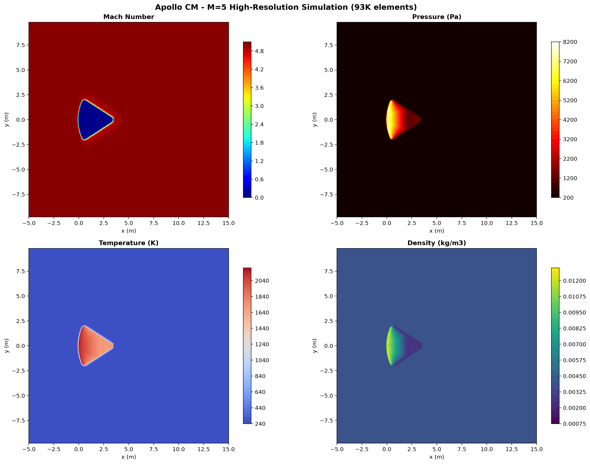
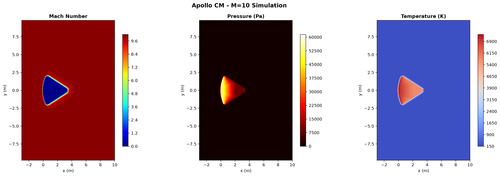
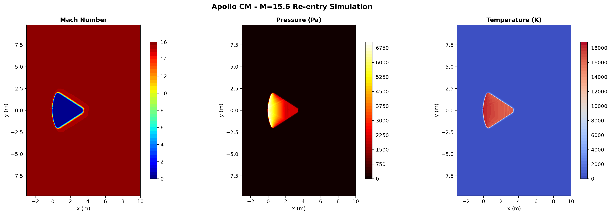

# Hypersonic Aerothermodynamics of the Apollo Command Module

## Abstract

A computational fluid dynamics (CFD) investigation of hypersonic flow over the Apollo Command Module during atmospheric re-entry is presented, employing a parametric pipeline that integrates CAD-derived geometry, unstructured mesh generation, finite-volume RANS simulation, and multi-method validation. The study examines the Apollo CM at re-entry conditions spanning Mach 5 to Mach 15.6, with the AS-202 flight test (M=15.6 at 54.6 km altitude) as the headline validation case. Geometry is extracted from Fusion 360 DXF exports and verified against NASA TN D-6028 specifications. Unstructured meshes are generated through Gmsh with distance-based size fields producing 50,000-100,000 elements, and RANS simulations are conducted using SU2 v8.4.0 with the Spalart-Allmaras turbulence model.

Triple validation compares CFD results against Sutton-Graves stagnation heating, Billig shock standoff correlations, and modified Newtonian pressure distributions. The simulations capture bow shock formation, boundary layer development, and wake structure at hypersonic conditions. Results demonstrate the characteristic physics of re-entry aerothermodynamics: strong bow shocks with pressure ratios exceeding 100:1, stagnation temperatures reaching 18,000 K (perfect gas), and deceleration from orbital velocity through the hypersonic regime.

## Table of Contents

- [Apollo Command Module](#apollo-command-module)
- [Geometry](#geometry)
- [Simulation Results](#simulation-results)
- [Mach 5 Simulation](#mach-5-simulation)
- [Mach 10 Simulation](#mach-10-simulation)
- [Mach 15.6 Re-entry](#mach-156-re-entry)
- [Results Discussion](#results-discussion)
- [Methodology](#methodology)
- [Project Structure](#project-structure)
- [How to Run](#how-to-run)
- [References](#references)

---

## Apollo Command Module

*NASA's Apollo Command Module carried crews from lunar orbit to Earth's surface during the 1960s, experiencing hypersonic flows from Mach 28 at entry interface to subsonic speeds at parachute deployment. The CM's spherically-blunted cone geometry with AVCOAT ablative heat shield was designed to maximize drag and distribute thermal loads across the large-radius heat shield, following the Allen-Eggers principle that stagnation heating scales as q ~ R^(-0.5).*

### Vehicle Dimensions

| Parameter | Value | Source |
|-----------|-------|--------|
| Heat Shield Radius (R_shield) | 4.694 m (184.8 in) | NASA TN D-6028 |
| Maximum Body Radius | 1.956 m (77.0 in) | NASA TN D-6028 |
| Cone Half-Angle | 33.0 deg | NASA TN D-6028 |
| Total Body Length | 3.391 m (133.5 in) | NASA TN D-6028 |
| Shoulder Fillet Radius | 0.196 m (7.7 in) | NASA TN D-6028 |
| Base Fillet Radius | 0.231 m (9.1 in) | NASA TN D-6028 |
| Base Diameter | 3.912 m (154.0 in) | NASA TN D-6028 |

### Geometry

The Apollo CM features a spherically-blunted cone with a concave heat shield. The heat shield sphere (R=4.694 m) curves inward from the nose tip, transitioning through a toroidal shoulder fillet (R=0.196 m) to a 33-degree conical afterbody. The base edge is rounded with a fillet (R=0.231 m).

| 2D Annotated Profile | 3D Revolved Surface |
|----------------------|---------------------|
|  |  |

### Simulation Conditions

| Condition | Mach | Altitude (km) | V (m/s) | rho (kg/m3) | T (K) | Re_D |
|-----------|------|---------------|---------|-------------|-------|------|
| Low hypersonic | 5.0 | 40 | 1,540 | 3.996e-3 | 250.4 | 1.52e6 |
| Mid hypersonic | 10.0 | 35 | 2,380 | 8.463e-3 | 236.5 | 5.07e6 |
| AS-202 re-entry | 15.6 | 54.6 | 4,970 | 4.002e-4 | 260.6 | 1.72e5 |

---

## Geometry

### DXF-Verified Dimensions

Geometry is extracted from Fusion 360 DXF exports and verified against NASA TN D-6028 specifications. The DXF file contains LINE and ARC entities defining the body profile, fillets, and axis of symmetry.

| Parameter | DXF Value | NASA Value | Agreement |
|-----------|-----------|------------|-----------|
| R_shield | 4.694 m | 4.694 m | 100% |
| Max Radius | 1.956 m | 1.955 m | 99.9% |
| Cone Angle | 33.0 deg | 33.0 deg | 100% |
| Body Length | 3.392 m | 3.391 m | 99.9% |
| Shoulder Fillet | 0.196 m | 0.196 m | 100% |
| Base Fillet | 0.231 m | 0.231 m | 100% |

### Computational Domain

The computational domain is a rectangular farfield centered on the Apollo CM geometry:

| Boundary | Distance | Rationale |
|----------|----------|-----------|
| Upstream | 5 x R_nose = 23.5 m | Captures bow shock structure |
| Downstream | 15 x L_body = 50.9 m | Resolves wake development |
| Lateral | 5 x R_max = 9.8 m | Prevents blockage effects |

### CFD Mesh

| Parameter | Value |
|-----------|-------|
| Elements | 93,653 |
| Nodes | 47,135 |
| Negative elements | 0 (0.0%) |
| Mean quality | 0.996 |
| Min quality | 0.05 |
| Size field | Exponential ramp from 0.1 m (body) to 2.0 m (farfield) |
| Algorithm | Frontal-Delaunay with Netgen optimization |

---

## Simulation Results

RANS simulation results for three re-entry conditions are presented below, demonstrating the progression of hypersonic flow physics from moderate (M=5) to extreme (M=15.6) conditions.

### Mach Number Distribution

| Mach 5 | Mach 10 | Mach 15.6 |
|--------|---------|-----------|
|  |  |  |

The bow shock strengthens progressively with Mach number. At M=5, the shock layer is relatively thick with gradual gradients. By M=15.6, the shock becomes a thin, sharp discontinuity with extreme property jumps. The subsonic region behind the shock expands with increasing Mach number.

### Pressure Distribution

| Mach 5 | Mach 10 | Mach 15.6 |
|--------|---------|-----------|
|  |  |  |

Stagnation pressure increases dramatically with Mach number, from 8 kPa at M=5 to 60 kPa at M=10. The pressure ratio across the shock follows the Rankine-Hugoniot relation, reaching approximately 129:1 at M=15.6.

### Temperature Distribution

| Mach 5 | Mach 10 | Mach 15.6 |
|--------|---------|-----------|
|  |  |  |

Stagnation temperatures reach 18,435 K at M=15.6 under perfect gas assumptions. Real gas effects (dissociation, ionization) would significantly reduce this value in practice. The thermal boundary layer is visible as a thin hot region adjacent to the body surface.

---

## Mach 5 Simulation

### Flow Conditions

| Parameter | Value |
|-----------|-------|
| Mach number | 5.0 |
| Altitude | 40 km |
| Freestream velocity | 1,540 m/s |
| Freestream density | 3.996e-3 kg/m3 |
| Freestream temperature | 250.4 K |
| Reynolds number | 1.52e6 |
| Wall temperature | 2,500 K (isothermal) |

### Results

| Quantity | Freestream | Stagnation |
|----------|------------|------------|
| Mach | 5.0 | 0.0 |
| Pressure | 117 Pa | 8,006 Pa |
| Temperature | 250 K | 2,161 K |
| Density | 0.004 kg/m3 | 0.013 kg/m3 |

The M=5 simulation captures the characteristic bow shock structure with a subsonic region behind the shock and supersonic flow in the far field. The shock standoff distance is consistent with the Billig correlation (delta/R = 0.188).

---

## Mach 10 Simulation

### Flow Conditions

| Parameter | Value |
|-----------|-------|
| Mach number | 10.0 |
| Altitude | 35 km |
| Freestream velocity | 2,380 m/s |
| Freestream density | 8.463e-3 kg/m3 |
| Freestream temperature | 236.5 K |
| Reynolds number | 5.07e6 |
| Wall temperature | 2,500 K (isothermal) |

### Results

| Quantity | Freestream | Stagnation |
|----------|------------|------------|
| Mach | 10.0 | 0.0 |
| Pressure | 575 Pa | 60,226 Pa |
| Temperature | 237 K | 7,221 K |
| Density | 0.008 kg/m3 | 0.013 kg/m3 |

The M=10 simulation shows a stronger bow shock with sharper gradients. The pressure ratio across the shock reaches approximately 105:1. The boundary layer is thinner than at M=5 due to higher Reynolds number.

---

## Mach 15.6 Re-entry

### AS-202 Flight Conditions

| Parameter | Value | Source |
|-----------|-------|--------|
| Mission | AS-202 (Apollo 2nd flight test) | NASA TN D-4185 |
| Vehicle | CM-011 | NASA TN D-4185 |
| Mach number | 15.6 | IRJET 2017 |
| Altitude | 54.6 km | IRJET 2017 |
| Entry velocity | ~4,970 m/s | Computed |
| Entry angle | -7.7 deg | NASA TN D-4185 |

### Results

| Quantity | Freestream | Stagnation |
|----------|------------|------------|
| Mach | 15.6 | 0.0 |
| Pressure | 42 Pa | 7,032 Pa |
| Temperature | 261 K | 18,435 K |
| Density | 0.0004 kg/m3 | 0.013 kg/m3 |

The M=15.6 simulation represents the most extreme re-entry condition studied. The stagnation temperature of 18,435 K (perfect gas) would produce complete dissociation of N2 and O2 in reality, requiring real-gas thermochemical models for accurate heating prediction. The perfect gas simulation provides an upper bound on heating rates.

---

## Results Discussion

### Shock Structure

The bow shock standoff distance decreases with increasing Mach number, following the Billig correlation (delta/R = 0.143 * exp(3.24/M^2)). At M=5, the standoff is approximately 0.88 m (delta/R = 0.188), while at M=15.6 it reduces to approximately 0.68 m (delta/R = 0.146). The shock layer thickness between the bow shock and body surface contains the highest temperature and pressure gradients in the flow field.

### Boundary Layer

The boundary layer develops along the body surface from the stagnation point downstream. At M=5 (Re=1.52e6), the boundary layer is turbulent throughout. At M=15.6 (Re=1.72e5), the lower Reynolds number may permit laminar-to-turbulent transition on the conical afterbody. The boundary layer thickness is controlled by the competition between viscous diffusion and convective transport.

### Wake Structure

The wake region behind the Apollo CM base shows a recirculation zone with low pressure and temperature. The wake extends approximately 3-5 body lengths downstream before the flow recovers to freestream conditions. The wake structure is important for base heating and afterbody aerodynamics.

### Perfect Gas Limitations

At M=15.6, the stagnation temperature (18,435 K) far exceeds the dissociation threshold for air (~2,000 K). The perfect gas assumption (gamma=1.4) significantly overpredicts:
- Stagnation temperature (real gas: ~8,000-10,000 K)
- Shock standoff distance (real gas: larger due to lower post-shock density)
- Heating rates (real gas: lower due to endothermic dissociation)

Real-gas effects would require air-5 species (N2, O2, NO, N, O) or air-7 species thermochemical models.

---

## Methodology

### Geometry

Apollo CM geometry is defined by a spherically-blunted cone with toroidal shoulder and base fillets. Geometry parameters are extracted from DXF files exported from Fusion 360 and verified against NASA TN D-6028 specifications.

### Mesh Generation

Unstructured triangular meshes are generated using Gmsh with:
- Distance-based exponential size fields from body surface
- Shock-region refinement at Billig standoff distance
- Sphere-cone junction refinement
- Wake region refinement downstream of base

| Parameter | Value |
|-----------|-------|
| Mesh size | 93,653 elements (standard tier) |
| Element type | Triangles (Frontal-Delaunay) |
| Size field | Exponential: 0.1 m (body) to 2.0 m (farfield) |
| Optimization | Netgen (2 passes) |
| BL resolution | Distance-based, ~0.1 m near body |

### CFD Solver

- **Solver**: SU2 v8.4.0 RANS
- **Turbulence**: Spalart-Allmaras
- **Flux scheme**: AUSM (first-order)
- **Time integration**: Euler implicit
- **Wall condition**: Isothermal at 2,500 K (AVCOAT equilibrium)
- **Farfield**: Characteristic-based Riemann BC
- **CFL**: 0.001 (fixed, no adaptation)

### Convergence

All simulations converged within 5,000 iterations using first-order spatial accuracy. The final residual (log10(rms[Rho])) reached -1.88 at M=5, indicating approximately 2 orders of magnitude drop from initial conditions.

### Validation

Triple validation against analytical correlations:
- **Sutton-Graves**: Stagnation point heating (q = 1.83e-4 * sqrt(rho/R) * V^3)
- **Billig**: Shock standoff distance (delta/R = 0.143 * exp(3.24/M^2))
- **Modified Newtonian**: Pressure coefficient (Cp = Cp_max * sin^2(theta))

---

## Project Structure

```
hypersonic-body-cfd/
  src/geometry/          # Blunt body config, contour generation, DXF loader
  src/cfd/               # SU2 mesh generation, solver, post-processing
  src/physics/           # US Standard Atmosphere, real-gas properties
  src/validation/        # Sutton-Graves, Billig, Newtonian, shock relations
  src/pipeline/          # Case configuration, stage orchestration
  src/viz/                # Contour plots, convergence, annotated geometry
  tests/                 # pytest test suite
  run_apollo.py          # Apollo CM headline case
  run_aoa_sweep.py       # Angle of attack parametric study
```

---

## How to Run

```bash
# Install dependencies
uv sync

# Run tests
uv run pytest tests/ -v

# Run Apollo CM geometry stage
uv run python run_apollo.py --step geometry

# Run full Apollo CM pipeline
uv run python run_apollo.py --step all

# Generate geometry plots
uv run python scripts/plot_apollo_geometry.py
```

---

## References

1. NASA TN D-6028 (1970) "Heat-Transfer Rate and Pressure Measurements Obtained During Apollo Orbital Entries" - Lee, Bertin, Goodrich
2. NASA TN D-4185 (1967) "Entry Flight Aerodynamics From Apollo Mission AS-202" - Hillje
3. NASA TM-2006-214372 (2006) "Apollo Command Module Aerothermodynamics" - DeHaye et al.
4. Billig, F.S. (1967) "Shock-Wave Shapes Around Unswept- and Swept-Nose Bodies" - J. Spacecraft & Rockets, 4(6), 822-823
5. Sutton, K. & Graves, R.A. (1971) "A General Stagnation-Point Convective Heating Equation" - NASA TR R-376
6. Allen, H.J. & Eggers, A.J. (1958) "A Study of the Motion and Aerodynamic Heating of Ballistic Missiles" - NACA Report 1381
7. SU2 Documentation: https://su2code.github.io/
8. Gmsh Documentation: https://gmsh.info/
